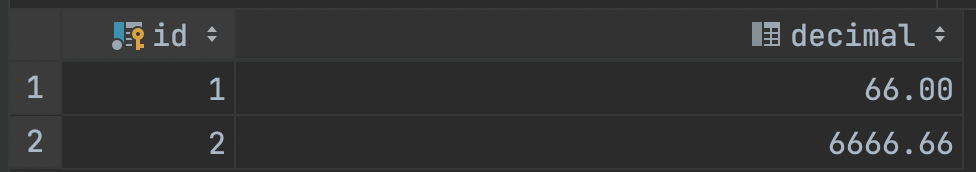

# Simple Decimal
Java library with more convenient class alternative BigDecimal!

### Download
Maven:
```xml
<dependency>
  <groupId>xyz.ukrainskiys</groupId>
  <artifactId>simple-decimal</artifactId>
  <version>1.0</version>
</dependency>
```
Gradle:
```groovy
dependencies {
  implementation 'xyz.ukrainskiys:simple-decimal:1.0'
}
```

### Documentation
##### Create instance:

```java
import xyz.ukrainskiys.decimal.Decimal;

class Main {

  public static void main(String[] args) {
    var decimal = new Decimal(); // 0
    var decimal = new Decimal(BigDecimal.valueOf(666)); // 666
    var decimal = Decimal.of(666); // 666
    var decimal = Decimal.of(6.66); // 6.66
    var decimal = Decimal.ofKopecks(12345); // 123.45
  }
}
```

##### Constants:

```java
Decimals.ZERO;
Decimals.ONE;
Decimals.TEN; 
Decimals.HUNDRED;
Decimals.THOUSAND;
```

##### Comparison:
```java
Decimals.HUNDRED.more(Decimals.TEN); // true   
Decimals.HUNDRED.less(Decimals.TEN); // false   
Decimals.HUNDRED.more(100); // false
    
Decimal.of(10).max(Decimal.of(15)); // 15
    
Decimal.of(10).is(BigDecimal.TEN); // true   
Decimal.of(10.00).is(10); // true
```

##### Default operations:
```java
import xyz.ukrainskiys.decimal.constant.Decimals;

class Main {

  public static void main(String[] args) {
    final var decimal = Decimals.HUNDRED;
    
    decimal.add(Decimals.ONE); // 101
    decimal.subtract(1.5); // 99.5
    decimal.multiply(5); // 500
    decimal.safeDivide(Decimals.TEN); // 10
    decimal.safeDivide(33); // 3.0303030303
  }
}
```

##### Additional features:
```java
Decimal.of(200).ofPercent(50); // 100
    
Decimal.of(3.0303030303).safeSetScale(1); // 3.0   
Decimal.of(3.0303030303).setScaleWithKopecks(); // 3.03
Decimal.of(3.0303030303).setScale(2, RoundingMode.HALF_UP); // 3.03 (Standard BigDecimal method)
```

##### JPA:
For use the Decimal class with JPA, you must specify a converter.
```java
import javax.persistence.Column;
import javax.persistence.Convert;
import javax.persistence.Entity;
import javax.persistence.Id;
import xyz.ukrainskiys.decimal.Decimal;
import xyz.ukrainskiys.decimal.converter.DecimalConverter;

@Entity
public class TestElement {

  @Id
  @Column(name = "id", nullable = false)
  private Long id;

  @Convert(converter = DecimalConverter.class)
  private Decimal decimal;
}
```
In the table, this will be the numeric type, like BigDecimal.

